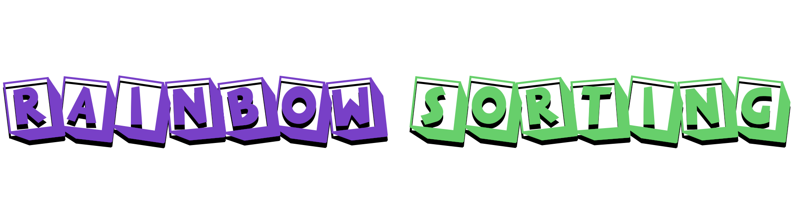
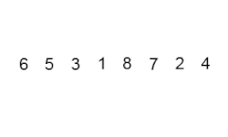

# Rainbow Sorting 🍭

> A Python application that visualizes how sorting algorithms work, painting every array element with a smooth rainbow of RGB colours.

Each value in the array is drawn as a vertical bar whose **height** encodes the value and whose **colour** is taken from a continuous RGB gradient. As an algorithm runs, you can watch the bars swap and settle into place in real time, with a live counter of array accesses and (optionally) sound generated from each move.


## Features

- Real-time visualization of several classic sorting algorithms.
- Full-colour RGB gradient mapping for every array element.
- Live array-access counter and on-screen algorithm/size information.
- Optional sound generation, where each moved element plays a tone based on its value.
- Configurable array size and algorithm, all from a single file.

## Implemented algorithms

The following algorithms are implemented in `Sorting_Algorithms.py`:

| # | Algorithm |
|---|-----------|
| 1 | Insertion Sort |
| 2 | Cocktail Shaker Sort |
| 3 | Bubble Sort |
| 4 | Tim Sort |
| 5 | Cycle Sort |

Two extra visualization modes are also included:

| # | Mode |
|---|------|
| 6 | Rotation |
| 7 | Elements Increaser |

### A few examples

| Insertion Sort | Bubble Sort |
|:---:|:---:|
|  |  |

| Cocktail Shaker Sort | Tim Sort |
|:---:|:---:|
|  |  |

## Requirements

- **Windows** — the app relies on `ctypes.windll` and `winsound`, so it is designed to run on Windows.
- **Python 3.7+**
- [PyGame](https://www.pygame.org/), [NumPy](https://numpy.org/) and [PyAudio](https://pypi.org/project/PyAudio/)

## Installation

Use the package manager [pip](https://pip.pypa.io/en/stable/) to install the dependencies:

```bash
pip install pygame numpy pyaudio
```

## Usage

Run the application with Python 3.7 or newer:

```bash
python Main.py
```

To change the array size, the algorithm or the sound, edit the configuration constants at the top of `Main.py`:

```python
ARRAY_SIZE = 1024  # Number of elements. Max value is 10000.
AL = 4             # 1: Insertion Sort, 2: Cocktail Shaker Sort, 3: Bubble Sort,
                   # 4: Tim Sort, 5: Cycle Sort, 6: Rotation, 7: Elements Increaser.
SOUND = False      # Play a tone on each move. Sound works fully on Insertion Sort.
```

> **Note:** When using **Tim Sort** (`AL = 4`), `ARRAY_SIZE` must be a power of two (e.g. 64, 128, 256, 512, 1024).

### Controls

| Key | Action |
|-----|--------|
| `Esc` | Quit the application |

## How to add more algorithms

You just have to follow this pattern for any other algorithm that you want to implement.
In `Sorting_Algorithms.py`:

```python
def Sorting_Algorithm(Array):  # Example algorithm, without visualization.
    # Here goes the sorting operations.
    return Array

def Sorting_Algorithm(MyArray, Win, Font):
    """
    Here goes the sorting operations.
    Change every part where you are using Array,
    and replace it by MyArray.Array (except the return).
    Every time your algorithm accesses the array,
    add this code to visualize the changes:
    """
    # Add to this list the elements that you are moving on this step.
    MyArray.Moving_Elements = [a, b, c, d]
    KEY = KEY_PRESSED()
    if KEY == "QUIT":
        pygame.quit()
        sys.exit()
    else:
        MyArray.Draw(Win, Font)
    # ...
    MyArray.isSorted = True
    return MyArray
```

Finally, go to `Main.py` and add your algorithm to the import at the top:

```python
from Sorting_Algorithms import InsertionSort, CocktailShakerSort, BubbleSort, TimSort
```

## Project structure

| File | Purpose |
|------|---------|
| `Main.py` | Entry point and configuration. |
| `Sorting_Algorithms.py` | Implementations of the sorting algorithms and visualization modes. |
| `Array_GUI.py` | The `Visualized_Array` class: colour mapping and rendering. |
| `GUI_Functions.py` | Keyboard input handling. |
| `Sound_Generator.py` | Tone generation for the sound feature. |
| `Exceptions.py` | Custom exceptions. |
