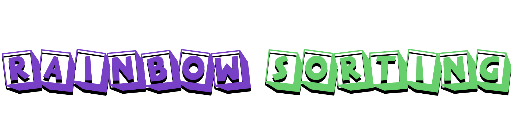

## Array Visualizer 🍭
[Python 3.7](https://www.python.org/) software to visualize an array, using common sorting algorithms to visualize how this algorithms are working.
## Installation

Use the package manager [pip](https://pip.pypa.io/en/stable/) to install [PyGame](https://www.pygame.org/news), [NumPy](https://numpy.org/) and [PyAudio](https://pypi.org/project/PyAudio/)

```bash
pip install pygame
pip install numpy
pip install pyaudio
```

## Usage
With everything installed, open Main.py file with Python 3.7.
If you want to change the array size, or the algorithm, go to Main.py file:
```python
ARRAY_SIZE = # Select your size, max value is 1500.
AL = 1 # 1 for Insertion Sort, 2 for Cocktail Shaker Sort, 3 for Bubble Sort and 4 for Tim Sort.
SOUND = True # Choose if you want to hear the moves (Not working for Tim Sort).
```

## Example Video


## How to add more algorithms?
You just have to follow this pattern for any other algorithm that you want to implement.
On Sorting_Algorithms.py
```python
def Sorting_Algorithm(Array): # Example algorithm, without visualization.
    # Here goes sorting operations.
    return Array
    
def Sorting_Algorithm(MyArray, Win, Font):
    """
    Here goes sorting operations.
    Change every part where you are using Array, 
    and replace it by MyArray.Array. (Except return)
    Now every time that your algorithm access to the array, 
    add this code, to visualize the changes:
    """
    # Add to this list the elements that you are moving on this step.
    MyArray.Moving_Elements = [a, b, c, d...]
    KEY = KEY_PRESSED()
    if KEY == "QUIT":
        pygame.quit()
        sys.exit()
    else:
        MyArray.Draw(Win, Font)
    .
    .
    .
    .
    MyArray.isSorted = True
    return MyArray
    
# Finally, go to Main.py, and at line 8, add to it the name of your algoritm.
from Sorting_Algorithms import InsertionSort, CocktailShakerSort, BubbleSort, TimSort
```
